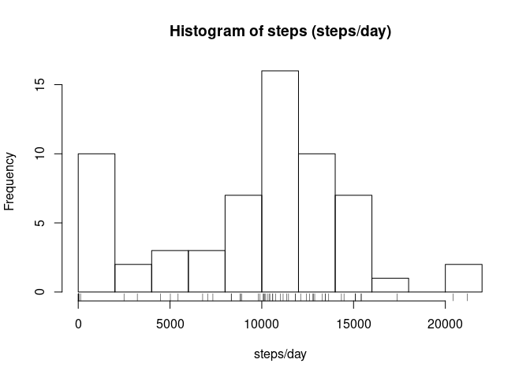
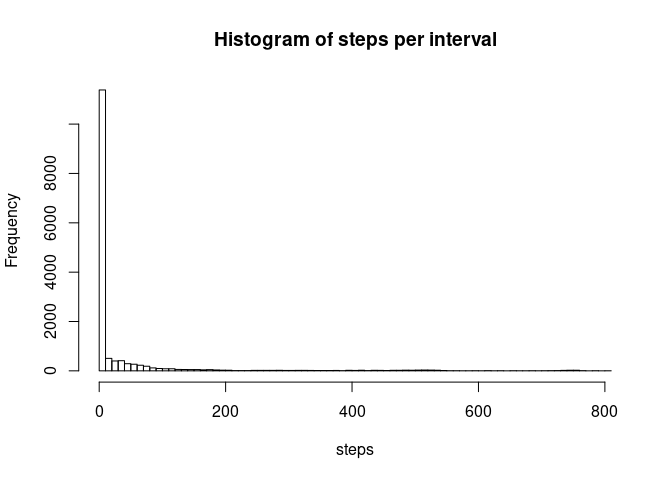
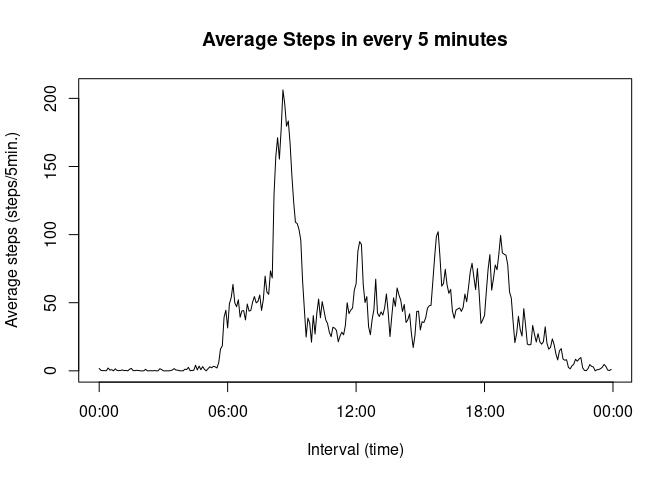
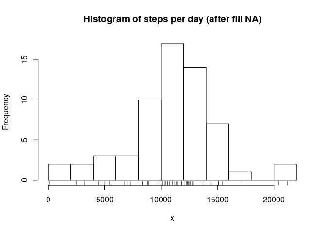
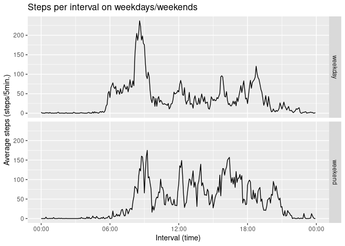

In this project, we will explore activity monitoring data set.

The detailed project description is described in `README.md`.

### Requirements

The scripts are written in `R` (version 3.6.3).

Additionally, this project uses following package(s).
```
dplyr==1.0.6
ggplot2==3.3.3
```

<br />

### Loading and preprocessing the data

The data is in `activity.zip`. In this script, it does not include unzip or preparing the data,
and assumed the unzipped data is in `./data` directory.


```r
data <- read.csv("./data/activity.csv", 
                 colClasses=c("integer", "Date", "integer"),
                 header=T)

# convert time integer to time (datetime) object
# this will automatically fill the date as well, but we will ignore it
data$time <- as.POSIXct(sapply(data$interval, function(x) sprintf("%04d", x)), format="%H%M")

# convert from character to Date for later grouping
data$date <- as.Date(data$date, format="%Y-%m-%d")
```

<br />

### What is mean total number of steps taken per day?

1. Make a histogram of the total number of steps taken per day

```r
# Calculate mean of steps grouped by date excluding NA
steps_per_day <- aggregate(data$steps, list(data$date), sum, na.rm=T)

hist(steps_per_day$x,
     breaks=10,
     main="Histogram of steps (steps/day)",
     xlab="steps/day")
rug(steps_per_day$x)
```

<!-- -->

2. Calculate and report the mean and median total number of steps taken per day


```r
mean_steps_per_day <- mean(steps_per_day$x)
median_steps_per_day <- median(steps_per_day$x)
print(sprintf("Mean of steps per day:   %.4f", mean_steps_per_day))
```

```
## [1] "Mean of steps per day:   9354.2295"
```

```r
print(sprintf("Median of steps per day: %d", median_steps_per_day))
```

```
## [1] "Median of steps per day: 10395"
```

```r
with(data, hist(steps, breaks=100, main="Histogram of steps per interval"))
```

<!-- -->

Thus, no or quite few steps were taken in the intervals.

The numbers of steps are:

```r
print(sprintf("Total number of intervals with no steps:  %5d", sum(data$steps == 0, na.rm=T)))
```

```
## [1] "Total number of intervals with no steps:  11014"
```

```r
print(sprintf("Total number of intervals with any steps: %5d", sum(data$steps > 0, na.rm=T)))
```

```
## [1] "Total number of intervals with any steps:  4250"
```

<br />

### What is the average daily activity pattern?

1. Make a time series plot of the 5-minute interval (x-axis) and the average number of steps taken,
  averaged across all days (y-axis)


```r
steps_per_interval <- aggregate(data$steps, list(interval=data$time), mean, na.rm=T)
names(steps_per_interval) <- c("interval", "average_steps")
plot(steps_per_interval$interval,
     steps_per_interval$average_steps,
     type="l",
     xaxt="n",
     xlab="Interval (time)",
     ylab="Average steps (steps/5min.)",
     main="Average Steps in every 5 minutes")
tmrng <- range(steps_per_interval$interval)
start <- tmrng[1]
end <- tmrng[2]
axis(1, at=seq(start, end + 300, length=5), labels=c("00:00", "06:00", "12:00", "18:00", "00:00"))
```

<!-- -->

As can be seen, between around midnight and before 5 AM, any obvious activity was not detected.
(There are technically small fluctuation, but it should be an error in measurement.)

And more, more intense activities were made between 8:00 and 10:00 AM than other time in average.

2. Which 5-minute interval, on average across all the days in the dataset, contains the maximum number of steps?


```r
max_interval <- steps_per_interval[which.max(steps_per_interval$average_steps),]
print(paste("Interval: ", format(max_interval$interval, format("%H:%M")), " - ",
            format(max_interval$interval+300, format="%H:%M"),
            sprintf(" , Maximum average steps: %.4f", max_interval$average_steps), sep=""))
```

```
## [1] "Interval: 08:35 - 08:40 , Maximum average steps: 206.1698"
```
<br />

### Imputing missing values

1. Calculate and report the total number of missing values in the dataset (i.e. the total number of rows with `NAs`)

```r
# Calculate total number of elements whose values are NA
apply(apply(data, 2, is.na), 2, sum)
```

```
##    steps     date interval     time 
##     2304        0        0        0
```
It says that all `NA` values are in `steps` column, and the total count is $2304$.

2. Devise a strategy for filling in all of the missing values in the dataset.

In order to fill the missing values, impute the value by the mean of the steps on the same interval in the same weekday.
For instance, if the values on Monday are missing, filled with average of values on other Mondays.
To make it simplify, `NA`s are filled with rounded mean values instead of the mean values.

3. Create a new dataset that is equal to the original dataset but with the missing data filled in.


```r
library(dplyr)

# set weekdays as integer values
weekday_names = c("Monday", "Tuesday", "Wednesday", "Thursday", "Friday", "Saturday", "Sunday")
weekday_nums = 1:7
names(weekday_nums) <- weekday_names
data$weekday <- sapply(weekdays(data$date), function(x) weekday_nums[x])
data$interval_order <- as.integer(factor(data$interval))

# temporary store all mean values for fast look-up
step_map <- matrix(rep(0, 7 * length(unique(data$interval))), 7)

grouped <- as_tibble(data) %>%
  group_by(weekday, interval_order) %>%
  summarize(mean=round(mean(steps, na.rm=T)))

apply(grouped, 1, function(x) { step_map[x[1], x[2]] <<- x[3]; NULL })

# Impute without specific library such as mlr
data$steps <- as.integer(apply(data, 1, function(x) {
  if (is.na(x[1])) {
    step_map[as.integer(x[5]), as.integer(x[6])]
  } else {
    x[1]
  }
}))

# free temporary items
rm(step_map, grouped)
```

4. Make a histogram of the total number of steps taken each day and
  Calculate and report the mean and median total number of steps taken per day.
  Do these values differ from the estimates from the first part of the assignment?
  What is the impact of imputing missing data on the estimates of the total daily number of steps?

```r
steps_per_day2 <- aggregate(data$steps, list(date=data$date), sum)

with(steps_per_day2, hist(x, breaks=10, main="Histogram of steps per day (after fill NA)"))
rug(steps_per_day2$x)
```

<!-- -->


```r
mean_steps_per_day2 <- mean(steps_per_day2$x)
median_steps_per_day2 <- median(steps_per_day2$x)

print(sprintf("Mean of steps per day:   %.4f", mean_steps_per_day2))
```

```
## [1] "Mean of steps per day:   10821.0984"
```

```r
print(sprintf("Mean difference from the result before imputing: %.4f",
              mean_steps_per_day2 - mean_steps_per_day))
```

```
## [1] "Mean difference from the result before imputing: 1466.8689"
```

```r
print(sprintf("Median of steps per day: %d", median_steps_per_day2))
```

```
## [1] "Median of steps per day: 11015"
```

```r
print(sprintf("Median difference from the result before imputing: %3d",
              median_steps_per_day2 - median_steps_per_day))
```

```
## [1] "Median difference from the result before imputing: 620"
```
Hence, the imputing affected the mean of steps by increasing roughly $16\%$,
and the median by increasing $6\%$.
From this observation, missing values are appeared in the data whose date is more active than other dates.

<br />

### Are there differences in activity patterns between weekdays and weekends?

1. Create a new factor variable in the dataset with two levels --
"weekday" and "weekend" indicating whether a given date is a weekday or weekend day.


```r
# weekday is 1: Sunday, 2: Monday, ..., 7: Saturday
# so that if weekday is 6 or 7, it is weekends
data$weekend <- data$weekday > 5
```

2. Make a panel plot containing a time series plot of the 5-minute interval (x-axis) and
the average number of steps taken, averaged across all weekday days or weekend days (y-axis).


```r
library(ggplot2)

steps_per_interval2 <- aggregate(data$steps,
                                 list(interval=data$time,
                                      day_type=ifelse(data$weekend, "weekend", "weekday")),
                                 mean)

ymax <- max(steps_per_interval2$x)

ggplot(steps_per_interval2,
       aes(x=interval, y=x, day_type),
       ylim=c(0, ymax)) +
  facet_grid(rows=vars(day_type)) +
  geom_line() +
  ggtitle("Steps per interval on weekdays/weekends") +
  xlab("Interval (time)") +
  ylab("Average steps (steps/5min.)") +
  scale_x_datetime(date_labels="%H:%M")
```

<!-- -->

From the result above, the activity in the morning on weekdays are intense, but not in the evening.
Whereas, it is averagely active in all day on weekends.
